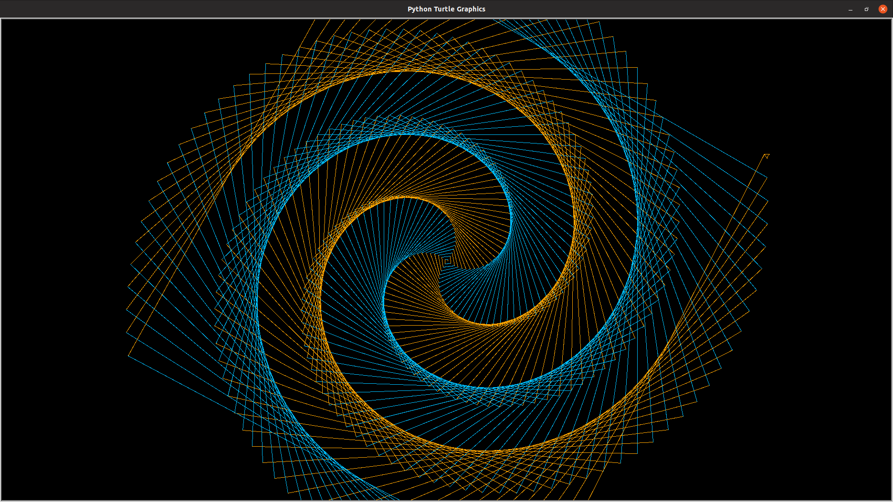
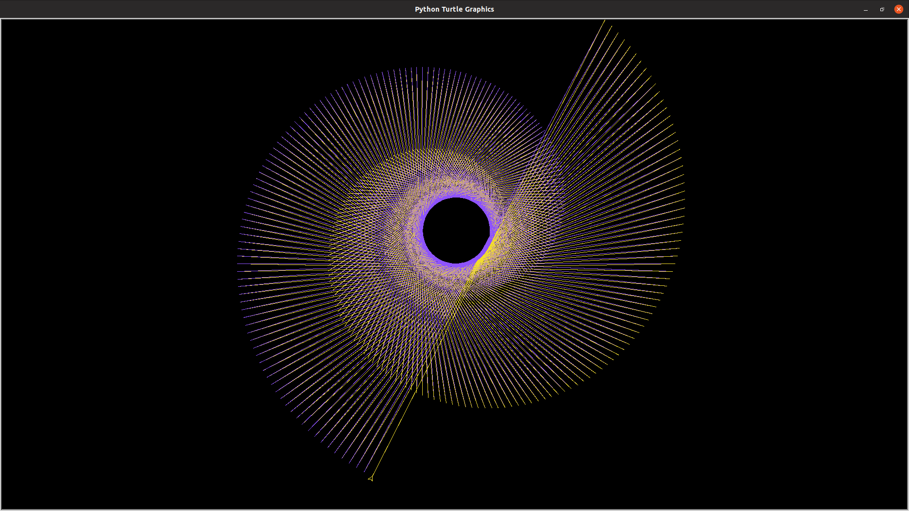
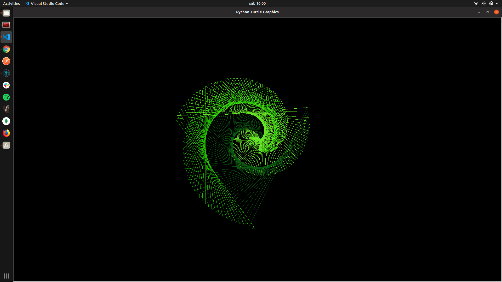
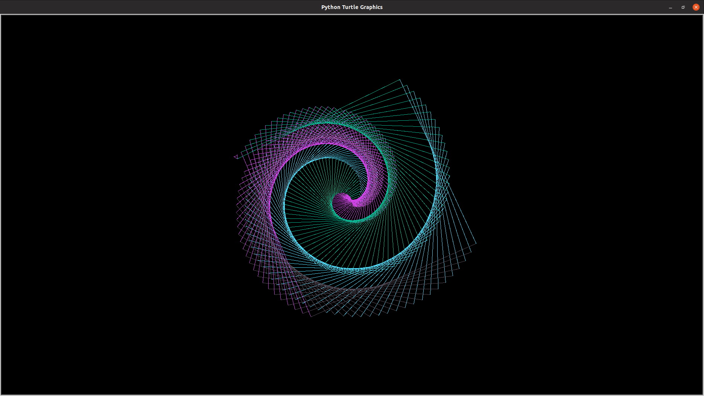
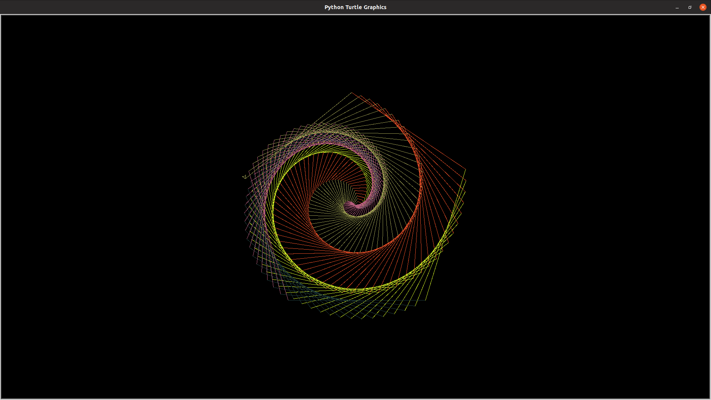
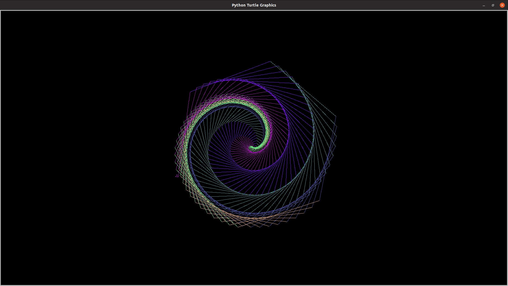

# Generative Art

## Rose

```bash
make rose
```



## Linear

```bash
make linear
```



## Triangle

```bash
make triangle
```



## Square

```bash
make square
```



## Pentagon

```bash
make pentagon
```



## Hexagon

```bash
make hexagon
```



## Magic

```bash
make magic
```
